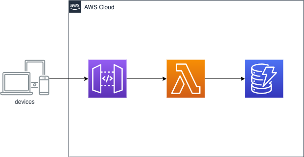

# Golang + ServerlessFramework (APIGateway + Lambda + DynamoDB)を使用して簡易的なアプリを作ってみた

この記事は [Fusic Advent Calender](https://qiita.com/advent-calendar/2020/fusic)の 17 日目の記事です。

昨日は夛田君の[ちゃんと TypeScript で async/await を書く](https://tech.fusic.co.jp/posts/2020-12-15-typescript-async-await/)という記事でした。\
僕は、社会人になる前まで非同期処理を async/await を知らずに Promise を使用して書いてた勢なので、async/await を教えてもらった時は感動した覚えがあります。  
シンプルな記述で非同期処理を同期的に書けるのが魅力的ですよね。

さて今回ですが、下記のようなカレンダーアプリの Todo 機能のバックエンドを APIGateway + Lambda + DynamoDB のサーバーレス構成で作りました。

## デモ画面

日付の部分を予め id 属性に振り分けておき、その id 属性を動的に取得して GET や POST をするようにしています。


## 構成図



## 仕様

### リポジトリ

https://github.com/fujisawaryohei/go-serverless-for-vue-calendar

### APIGateway（Lambda プロキシ統合を使用）

| HTTP メソッド | パス  | 仕様                                     |
| ------------- | ----- | ---------------------------------------- |
| GET           | /todo | クエリ文字列で DynamoDB の検索を行う API |
| POST          | /todo | DynamoDB に保存する API                  |

### DynamoDB

| 項目      | データ型 | キー               |
| --------- | -------- | ------------------ |
| TimeStamp | String   | パーティションキー |
| content   | String   | ソートキー         |

### Client

弊社では研修でカレンダーアプリを作成します。僕は Vue.js でカレンダーを作りました。\
今回、研修で作成したカレンダーアプリをクライアントとして、 Todo データを永続化するためのバックエンドをサーバーレス構成でつくります。

リポジトリ: https://github.com/fujisawaryohei/vue-calendar

## ServerlessFramewok のテンプレート作成

ServerlessFramework をインストールしてください。

```
npm i -g serverless
```

今回は、Golang を使用して実装します。
ServerlessFramework には予め言語やプロバイダの組み合わせによってテンプレートが用意されています。
下記のコマンドを実行してテンプレートを作成してください。

```
sls create --template aws-go
```

ディレクトリ構成は下記のような形に編集します。

```
├── Makefile
├── README.md
├── getTodo
│   └── main.go
├── putTodo
│   └── main.go
└── bin
└── serverless.yml
```

合わせて`Makefile`を編集します。

Makefile

```:shell
.PHONY: build clean deploy

build:
	env GOOS=linux go build -ldflags="-s -w" -o bin/getTodo getTodo/main.go
	env GOOS=linux go build -ldflags="-s -w" -o bin/putTodo putTodo/main.go

clean:
	rm -rf ./bin

deploy: clean build
	sls deploy --verbose
```

## serverless.yml の編集

serverless.yml の編集をします。
ServerlessFramework を触る時、API GateWay の Lambda プロキシ統合の設定が直感的にコード化できて良いなぁと感じます。
下記の`serverless.yml`の編集ですが、 CORS の設定をしておく必要があることに注意してください。`cors: true` を `http` 以下に記載してください。
DynamoDB は上記の仕様に基づいて`resouces`以下で定義しています。

```yml
service: serverless-for-vue-calendar
frameworkVersion: "2"
provider:
  name: aws
  # API GateWayへのアクセスログの有効化をする
  logs:
    restApi: true
  runtime: go1.x
  stage: dev
  region: ap-northeast-1

  # Lambda関数に付与するDynamoDBのIAMロールの作成
  iamRoleStatements:
    - Effect: "Allow"
      Action:
        - "dynamodb:BatchGet*"
        - "dynamodb:DescribeStream"
        - "dynamodb:DescribeTable"
        - "dynamodb:Get*"
        - "dynamodb:Query"
        - "dynamodb:Scan"
        - "dynamodb:BatchWrite*"
        - "dynamodb:CreateTable"
        - "dynamodb:Delete*"
        - "dynamodb:Update*"
        - "dynamodb:PutItem"
      Resource: DynamoDBのARN

package:
  exclude:
    - ./**
  include:
    - ./bin/**

#Lambda関数の定義
functions:
  getTodo:
    handler: bin/getTodo
    events:
      # ApiGatewayの定義
      - http:
          path: /todo
          method: get
          cors: true
          # クエリストリングの設定
          request:
            parameters:
              querystrings:
                timestamp: true
  putTodo:
    handler: bin/putTodo
    events:
      # ApiGatewayの定義
      - http:
          path: /todo
          method: post
          cors: true

# DynamoDBのリソース定義
resources:
  Resources:
    myVueCalendarDB:
      Type: AWS::DynamoDB::Table
      Properties:
        AttributeDefinitions:
          - AttributeName: "timestamp"
            AttributeType: "S"
          - AttributeName: "content"
            AttributeType: "S"
        KeySchema:
          - AttributeName: "timestamp"
            KeyType: "HASH"
          - AttributeName: "content"
            KeyType: "RANGE"
        ProvisionedThroughput:
          ReadCapacityUnits: "5"
          WriteCapacityUnits: "5"
        TableName: "テーブル名"
```

## 実装

### POST /todo

`putTodo/main.go`に APIGateway で受け取ったリクエストボディを Lambda に渡して PutItem オペレーションで DynamoDB へ保存する処理を追加します。
`github.com/aws/aws-sdk-go/service/events`パッケージを使用することで APIGateway で受け取ったリクエストを Lambda に渡すことができます。
処理の流れとしては以下のようになります。

1. APIGateway から受け取ったリクエストをマッピングする構造体を定義
2. 受け取ったリクエストボディを定義した構造体にマッピング
3. マッピングした構造体のフィールドを使用して PutItemInput を作成
4. 作成した PutItemInput を使用して PutItem オペレーションの実行

Response 構造体を作成する時に注意すべき事として、CORS の許可があります。
`"Access-Control-Allow-Origin": "*"` のみをレスポンスヘッダーに加える事でブラウザからシンプルリクエストとしてリクエストを送る事ができます。

putTodo/main.go

```go
package main

import (
	"context"
	"encoding/json"
	"github.com/aws/aws-lambda-go/events"
	"github.com/aws/aws-lambda-go/lambda"
	"github.com/aws/aws-sdk-go/aws"
	"github.com/aws/aws-sdk-go/aws/session"
	"github.com/aws/aws-sdk-go/service/dynamodb"
)

type Request events.APIGatewayProxyRequest
type Response events.APIGatewayProxyResponse

type Item struct {
	Timestamp string `json: timestamp`
	Content   string `json: content`
}

func Hanlder(ctx context.Context, request Request) (Response, error) {
	mySession := session.Must(session.NewSession(&aws.Config{
    // 使用するリージョンの指定
		Region: aws.String("ap-northeast-1")},
	))
	svc := dynamodb.New(mySession)

  // 構造体の初期化
  item := Item{}
  // 初期化した構造体にリクエストボディをマッピングする
	if err := json.Unmarshal([]uint8(request.Body), &item); err != nil {
		panic(err)
	}

  // マッピングした構造体のTimestampフィールドとcontentフィールドを参照して
	putItemInput := &dynamodb.PutItemInput{
		TableName: aws.String("テーブル名"),
		Item: map[string]*dynamodb.AttributeValue{
			"timestamp": {
				S: aws.String(item.Timestamp),
			},
			"content": {
				S: aws.String(item.Content),
			},
		},
	}

  // PutItem オペレーションの実行
	_, err := svc.PutItem(putItemInput)
	if err != nil {
		panic(err)
	}

  // CORSを許可する必要があるためリクエストヘッダーにAccess-Control-Allow-Originを加える
	resp := Response{
		StatusCode:      200,
		IsBase64Encoded: false,
		Body:            "保存しました",
		Headers: map[string]string{
			"Access-Control-Allow-Origin": "*",
		},
	}
	return resp, nil
}

func main() {
	lambda.Start(Hanlder)
}
```

ここまで完了したら一度デプロイしていきます。

```
make deploy
```

`make deploy`コマンドを実行すると、`Makefile`に記載されている通り、上記の Go プログラムを Linux マシン向けにクロスコンパイルを行います。
そして、コンパイル後の実行ファイルを`sls deploy --verbose`コマンドでデプロイします。

保存されるかを確認するため、一度`curl`コマンドでテストをします。AWS マネジメントコンソールから APIGateway を開きます。
サイドメニューの「ステージ」を選択するとステージ一覧画面に行きます。ステージ一覧画面からステージを選択すると、URL の呼び出しというところに
APIGateway の DNS 名が表示されているのでこちらを使用して`curl`します。

```
curl -X POST -H "Content-Type: application/json" -d '{"timestamp":"2020-12-17", "content":"マスタリングTCP/IPを読む"}' APIGatewayのDNS名/todo
```

実行して下記のレスポンスが返ってくれば成功です。DynamoDB に保存されているはずなので、確認してみて下さい。

```
保存しました
```

以上で、Lambda の putTodo 関数ができました。

### GET /todo

今回は、`timestamp` のパーティションキーを使用した検索をするため、クライアントから検索したいキーを指定できるようにクエリ文字列を受け取る設定をしています。\
下記のように`timestamp`というクエリ文字列を取得するように指定します。

serverless.yml

```yml
getTodo:
  handler: bin/getTodo
  events:
    # ApiGatewayの定義
    - http:
        path: /todo
        method: get
        cors: true
        # クエリストリングの設定
        request:
          parameters:
            querystrings:
              timestamp: true
```

`getTodo/main.go`に APIGateway で受け取ったクエリ文字列を Lambda で参照して Query オペレーションで DynamoDB へ検索する処理を追加します。
処理の流れとしては以下のようになります。

1. DynamoDB の Query オペレーションの結果をマッピングするための構造体を定義
2. APIGateway で受け取ったリクエストからクエリ文字列を使用して検索条件を QueryInput で定義
3. 定義した QueryInput を基に Query オペレーション
4. `github.com/aws/aws-sdk-go/service/dynamodb/dynamodbattribute`パッケージを使用して、実行結果を 1 で定義した構造体にマッピング
5. `encoding/json`パッケージの Marshal を使用してマッピングした構造体を json へシリアライズ
6. シリアライズした Json をレスポンスボディに含めて返す

getTodo/main.go

```go
package main

import (
	"context"
	"encoding/json"
	"fmt"
	"github.com/aws/aws-lambda-go/events"
	"github.com/aws/aws-lambda-go/lambda"
	"github.com/aws/aws-sdk-go/aws"
	"github.com/aws/aws-sdk-go/aws/session"
	"github.com/aws/aws-sdk-go/service/dynamodb"
	"github.com/aws/aws-sdk-go/service/dynamodb/dynamodbattribute"
)

type Request events.APIGatewayProxyRequest
type Response events.APIGatewayProxyResponse

// dynamodbav というタグを利用することで、DynamoDBから受け取った検索結果をキーを指定して、定義した構造体とマッピングすることができる。
type Body struct {
	Timestamp string `json:"timestamp" dynamodbav:"timestamp"`
	Content   string `json:"content"   dynamodbav:"content"`
}

func Handler(ctx context.Context, request Request) (Response, error) {
	mySession := session.Must(session.NewSession(&aws.Config{
		Region: aws.String("ap-northeast-1")},
	))
  svc := dynamodb.New(mySession)

	queryInput := &dynamodb.QueryInput{
    TableName: aws.String("my-vue-calendar-db"),
    // timestampというカラムはDynamoDBに予約語として存在するため混同しないようにエイリアスを定義する必要がある
		ExpressionAttributeNames: map[string]*string{
			"#timestamp": aws.String("timestamp"),
    },
    // 今回は受け取ったクエリ文字列のtimestampと一致したデータを検索するため, KeyConditionExpressionで指定する
    KeyConditionExpression: aws.String("#timestamp = :timestamp"),
    // クエリ文字列を受け取る
		ExpressionAttributeValues: map[string]*dynamodb.AttributeValue{
			":timestamp": {
				S: aws.String(request.QueryStringParameters["timestamp"]),
			},
		},
	}

  // Query オペレーションの実行
	result, getErr := svc.Query(queryInput)
	if getErr != nil {
		panic(getErr)
	}

  // 上記で定義した構造体を構造体の配列として初期化
  body := []Body{}

  // DynamoDBで受け取ったリスト型を結果を構造体にマッピング
	if err := dynamodbattribute.UnmarshalListOfMaps(result.Items, &body); err != nil {
		panic(fmt.Sprintf("failed to unmarshal Dynamodb Scan Items, %v", err))
	}

  // マッピングした構造体をjsonへシリアライズ
	jsonData, _ := json.Marshal(body)

	resp := Response{
		StatusCode:      200,
		IsBase64Encoded: false,
		Body:            string(jsonData),
		Headers: map[string]string{
			"Access-Control-Allow-Origin": "*",
		},
	}
	return resp, nil
}

func main() {
	lambda.Start(Handler)
}
```

以上で、Lambda の getTodo 関数ができました。

再度デプロイします。

```
make deploy
```

検索できているかを確認するため、同じくこちらも`curl`コマンドでテストをします。

```
curl APIGatewayのDNS名/todo?timestamp=2020-12-17
```

返ってきましたら完了です。

```
[{"timestamp":"2020-12-17","content":"マスタリングTCP/IPを読む"}]
```

リソースが残り続けると料金がかかるのでこれらのリソースの削除を忘れないようにしましょう。  
下記のコマンドでデプロイしたリソースが削除されます。

```
sls remove -l
```

コマンド一発でデプロイが出来て、リソースの削除までサクッと行えちゃうのでとても開発が捗るなぁと感じました。
最後まで見て頂きありがとうございました。
