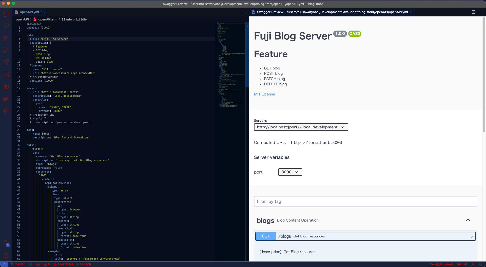
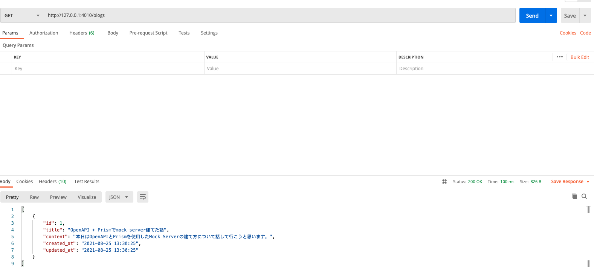

# OpenAPI で作成した API 定義書から Mock Server を起動してみた

今回は、便利なツールがあるよ〜的な話になります。  
あまり深い内容については触れておりませんので、ご容赦ください。

## API 定義書とは

API 定義書とは、URL やその URL へのリクエスト時ににどのようなデータ構造がレスポンスされるのかを定義する仕様書のことです。
この仕様書があることで、バックエンド側、フロントエンド側が、作成した定義書を参照しながらスムーズに開発できます。

## OpenAPI とは

RESTful API の使用を記述するための仕様、フォーマットのことです。

## Swagger とは

OpenAPI で API 定義書を作成する際に使用するツール郡のことです。

## 今回やること

今回は、タイトル通り、API 開発において、よく使用される OpenAPI で定義した API 定義書から mock server を起動します。

自分が実際に OpenAPI で API 定義書を作成していた際に、これを Mock Server で起動できたら便利だなぁと思って調べたところ、
Prism というツールがありました。

簡単に Mock Server が起動できたので、共有したいなというところから今回の記事を書いてみた動機です。

## 実際にやってみる

まずは、OpenAPI を用いて API 定義書を作成します。
今回は、MockServer を起動する事が目的であるため、簡易的な OpenAPI で作成した API 定義書を下記に載せておきます。

OpenAPI.yml

```yml
openapi: "3.0.3"

info:
  title: "Fuji Blog Server"
  description: |
    # Feature
    - GET blog
    - POST blog
  license:
    name: "MIT License"
    url: "https://opensource.org/license/MIT"
  version: "1.0.0"

servers:
  - url: "http://localhost:{port}"
    description: "local development"
    variables:
      port:
        enum: ["3000", "8080"]
        default: "3000"

tags:
  - name: blogs
    description: "Blog Content Operation"

paths:
  "/blogs":
    get:
      summary: "Get Blog resources"
      description: "(description): Get Blog resources"
      tags: ["blogs"]
      deprecated: false
      responses:
        "200":
          content:
            application/json:
              schema:
                type: array
                items:
                  type: object
                  properties:
                    id:
                      type: integer
                    title:
                      type: string
                    content:
                      type: string
                    created_at:
                      type: string
                      format: date-time
                    updated_at:
                      type: string
                      format: date-time
              example:
                - id: 1
                  title: "OpenAPI + Prismでmock server建てた話"
                  content: "本日はOpenAPIとPrismを使用したMock Serverの建て方について話して行こうと思います。"
                  created_at: "2021-08-25 13:30:25"
                  updated_at: "2021-08-25 13:30:25"
          description: "success operation"
        "401":
          $ref: "./errorResponses.yml#/components/responses/401-Unauthenticated"

    post:
      summary: "Post blog"
      description: "(description): Post blog"
      tags: ["blogs"]
      deprecated: false
      parameters:
        - name: X-Api-Key
          in: header
          description: "Request user's indenfiger"
          schema: { type: string }
          example: "XXXX-XXXX-XXXX-XXXX"
        - name: token
          in: cookie
          description: "One time token"
          schema: { type: string }
          example: "XXXX-XXXX-XXXX-XXXX"
      requestBody:
        description: "Content of review"
        required: true
        content:
          application/json:
            schema:
              properties:
                title:
                  type: string
                content:
                  type: string
                created_at:
                  type: string
                  format: date-time
                updated_at:
                  type: string
                  format: date-time
            example:
              title: "OpenAPI + Prismでmock server建てた話"
              content: "本日はOpenAPIとPrismを使用したMock Serverの建て方について話して行こうと思います。"
              created_at: "2021-08-25 13:30:25"
              updated_at: "2021-08-25 13:30:25"
      responses:
        "201":
          description: "success operation"
          headers:
            location:
              description: "New URL of created review"
              schema: { type: string, format: url }
        "400":
          $ref: "./errorResponses.yml#/components/responses/400-BadRequest"
        "401":
          $ref: "./errorResponses.yml#/components/responses/401-Unauthenticated"

  "/blogs/{blogId}":
    parameters:
      - name: blogId
        in: path
        description: "Blog idenfifer"
        required: true
        schema: { type: string }
        example: "1"

    get:
      summary: "Get specified Blog resource"
      description: "(description): Get specifed Blog resource"
      tags: ["blogs"]
      deprecated: false
      responses:
        "200":
          content:
            application/json:
              schema:
                type: object
                properties:
                  id:
                    type: integer
                  title:
                    type: string
                  content:
                    type: string
                  created_at:
                    type: string
                    format: date-time
                  updated_at:
                    type: string
                    format: date-time
                example:
                  id: 1
                  title: "OpenAPI + Prismでmock server建てた話"
                  content: "本日はOpenAPIとPrismを使用したMock Serverの建て方について話して行こうと思います。"
                  created_at: "2021-08-25 13:30:25"
                  updated_at: "2021-08-25 13:30:25"
          description: "success operation"
        "401":
          $ref: "./errorResponses.yml#/components/responses/401-Unauthenticated"
        "404":
          $ref: "./errorResponses.yml#/components/responses/404-NotFound"
```

errorResponse.yml

```yml
penapi: "3.0.3"

info:
  title: "Shop Review Api"
  description: |
    # Response Components
    - error format
  version: "1.0.0"

paths: {}

components:
  responses:
    400-BadRequest:
      description: "client side error"
      content:
        application/json:
          schema:
            type: object
            properties:
              code: { type: string }
              type: { type: string }
              message: { type: string }
              errors:
                # schema typeがArrayの場合は同じ階層にitemsオブジェクトを設置
                type: array
                items:
                  type: object
                  properties:
                    field: { type: string }
                    code: { type: string }
          example:
            code: 401
            type: BadRequest
            message: "不正な値が入力されています。"
            errors:
              - field: "content"
                code: "401"

    401-Unauthenticated:
      description: "unauthenticated error"
      content:
        application/json:
          schema:
            type: object
            properties:
              code: { type: string }
              type: { type: string }
              message: { type: string }
          example:
            code: "401"
            type: "unauthenticated"
            message: "権限がありません。再度認証してください。"

    404-NotFound:
      description: "not found error"
      content:
        application/json:
          schema:
            type: object
            properties:
              code: { type: string }
              type: { type: string }
              message: { type: string }
            example:
              code: "404"
              type: "Not Found"
              message: "存在しないURLです"
```

この構成なのですが、エラーレスポンスに関してコンポーネントにまとめてみました。

Blog リソースもコンポーネントにまとめたりして、再利用性や変更容易性を
向上させることができたのですが、面倒だったのと本題から外れるのでやっておりません。

また私は、普段 OpenAPI を書く際には、VsCode の[Swagger Viewer](https://marketplace.visualstudio.com/items?itemName=Arjun.swagger-viewer)というツールを使用します。

実際に表示される Swagger Viewr は以下のような感じです。



VSCode 勢にはおすすめですので、ぜひ使ってみてください。

### 実際に Mock Server を建ててみる。

では、この OpenAPI で作成した API 定義書を基に Mock Server を起動していきます。

今回の主役はこれです。

https://stoplight.io/open-source/prism/

Getting Started に記載されてある、npm をインストールします。

```sh
npm install -g @stoplight/prism-cli

# OR

yarn global add @stoplight/prism-cli
```

そして、起動します。

```sh
prism mock ./OpenAPI.yml
```

```sh
[6:45:44 PM] › [CLI] …  awaiting  Starting Prism…
[6:45:44 PM] › [CLI] ℹ  info      GET        http://127.0.0.1:4010/blogs
[6:45:44 PM] › [CLI] ℹ  info      POST       http://127.0.0.1:4010/blogs
[6:45:44 PM] › [CLI] ℹ  info      GET        http://127.0.0.1:4010/blogs/1
[6:45:44 PM] › [CLI] ▶  start     Prism is listening on http://127.0.0.1:4010
```

実際に、Postman で叩いてみます。



レスポンスが返ってきています。サクッと API 定義書から Mock Server が起動できました。

便利ですので、OpenAPI を使用される方はぜひ使ってみてください。
