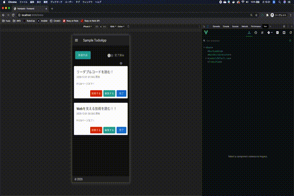
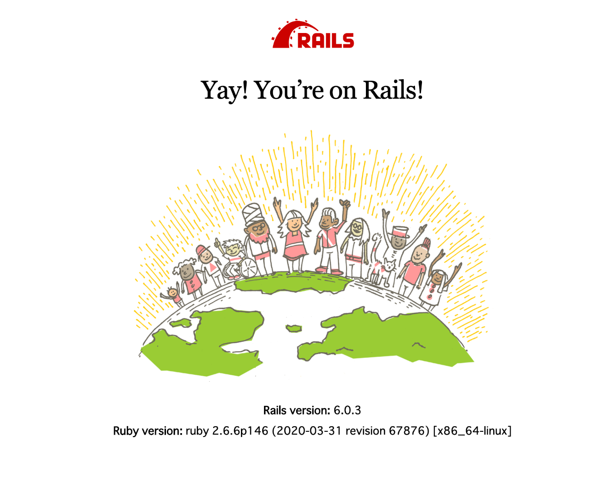
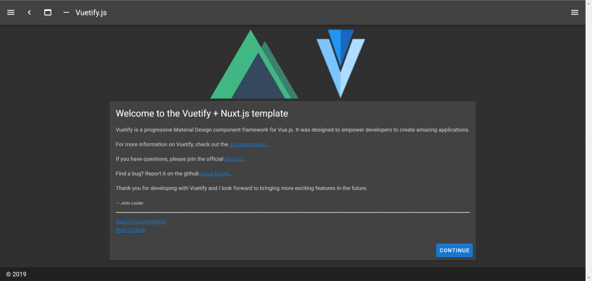

# Rails + Nuxt を使用して Todo アプリを Docker Compose で開発する

## 今回作成したアプリ



## 今回のファイル構成

Rails プロジェクトの中にフロントエンドディレクトリを作成してそこに Nuxt プロジェクトを展開する形にします。

```
├── todo-app
  ├── frontend
  └── docker-compose.yml
```

## 今回の流れ

1. 環境構築では、Rails と Nuxt の開発用イメージを作成
2. 開発では、作成したそれぞれのイメージを基に Docker-compose でコンテナを起動して開発を進める
3. デプロイでは、Rails と Nuxt の本番用イメージを作成して ECR に Push
4. Push した本番用イメージを Fargate でプルして起動

# 環境構築

## Rails の環境構築

### Rails new

まずは todo-calendar ディレクトリを作成して作成したディレクトリ以下で下記のコマンドを実行します。

```
bundle init
```

作成された Gemfile で`rails`の部分のコメントアウトします。

```rb
# frozen_string_literal: true

source "https://rubygems.org"

git_source(:github) {|repo_name| "https://github.com/#{repo_name}" }

gem "rails"
```

作成したディレクトリ直下で下記のコマンドで Rails プロジェクトを展開します。今回は API モードでの開発になるので`--api`を忘れないように。

```
bundle exec rails new . --api --database=postgresql
```

その後作成された Rails プロジェクトで dockerfile を作成します。  
作成されたら.gitignore ファイルに下記を追記してインストールしたライブラリを Git の管理対象外にしてください。

todo-calendar/.gitignore

```
/vendor
```

### dockerfile 作成

todo-calendar/dockerfile

```docker
FROM ruby:2.7.0

ENV LANG C.UTF-8
ENV TZ Asia/Tokyo

RUN mkdir /app
WORKDIR /app

ADD Gemfile /app/Gemfile

RUN apt-get update -qq

RUN bundle install

ADD . /app
```

### docker-compose.yml を作成

作成したディレクトリで docker-compose.yml ファイルにコンテナの構成を定義します。  
`networks`では、サブネット 172.10.0.0/24 の Docker ネットワークを定義しています。  
`backend`では、先程定義した Rails イメージを`command`で指定しているコマンドでコンテナとして起動するように定義しています。またその際コンテナに割り当てられるプライベート IP アドレスは、`172.10.0.3`になります。  
`db`では、postgresql11.5 のイメージを基にコンテナを定義しています。

```docker
version: "3"

services:
  db:
    container_name: todo-calendar-db
    image: postgres:11.5
    environment:
      TZ: Asia/Tokyo
      POSTGRES_PASSWORD: postgres
    volumes:
      - postgres_data:/var/lib/postgresql/data
    ports:
      - 3307:3306
    networks:
      app_net:
        ipv4_address: '172.10.0.2'

  backend:
    container_name: todo-calendar-backend
    build: .
    image: todo-calendar-backend
    command: bash -c "rm -f tmp/pids/server.pid && bundle exec rails s -p 3000 -b '0.0.0.0'"
    tty: true
    stdin_open: true
    volumes:
      - ./:/app:cached
    environment:
      TZ: Asia/Tokyo
    depends_on:
      - db
    ports:
      - 5000:3000 # ポートフォワード
    networks:
      app_net:
        ipv4_address: '172.10.0.3'

networks:
  app_net:
    driver: bridge
    ipam:
      driver: default
      config:
        - subnet: 172.10.0.0/24
volumes:
  postgres_data:
```

docker-compose build コマンドで dockerfile で定義したイメージのビルドを行って下さい。

```
docker-compose build
```

その後、docker-compose up コマンドでコンテナを起動して db コンテナでデータベースを作成してください。

```
docker-compose up
```

```
docker-compose exec backend bin/rails db:create
```

現在ポート 5000 でポートフォワーディングしているため、`localhost:5000`にアクセスすると下記のような画面になります。
これで Rails の開発環境構築ができました。



## Nuxt の環境構築

### create-nuxt-app

今回は、[create-nuxt-app](https://github.com/nuxt/create-nuxt-app) コマンドを使用して Nuxt のプロジェクトを作成します。  
Rails のプロジェクト内, todo-calendar 下記のコマンドを実行してください。

```
yarn create nuxt-app frontend
```

今回、コードフォーマッターに Prettier、リンターツールに ESLint を使用しています。  
また、API 通信をするために Axios, 画面をいい感じにしてくれる Vuetify を予めインストールとセッティングをするようにします。  
上記のコマンドを実行後、色々聞かれるので下記のような選択をするようにしてください。

```
   Generating Nuxt.js project in frontend
? Project name: frontend
? Programming language: JavaScript
? Package manager: Yarn
? UI framework: Vuetify.js
? Nuxt.js modules: Axios
? Linting tools: ESLint, Prettier
? Testing framework: Jest
? Rendering mode: Single Page App
? Deployment target: Server (Node.js hosting)
? Development tools: (Press <space> to select, <a> to toggle all, <i> to invert selection)
? Continuous integration: None
? Version control system: None
```

### dockerfile 作成

Nuxt プロジェクト作成後、作成された Nuxt プロジェクト内で Dockerfile を作成します。

todo-calendar/frontend/dockerfile

```docker
FROM node:12.16.3

RUN mkdir /app
WORKDIR /app

COPY package.json /app/
COPY package.lock.json /app/

RUN yarn install

```

### docker-compose.yml を編集

先程作成した docker-compose.yml ファイルに下記を追加してください。  
先程作成したイメージを基にコンテナ`yarn dev`で起動して、`172.10.0.4`のプライベート IP をコンテナに割り当てています。

```docker
frontend:
  container_name: todo-calendar-frontend
  build: ./frontend/
  image: todo-calendar-frontend
  volumes:
    - ./frontend:/app:cached
  ports:
    - 3000:3000
  command: "yarn run dev"
  networks:
    app_net:
      ipv4_address: "172.10.0.4"
  depends_on:
    - backend
    - db
```

docker-compose build コマンドで dockerfile で定義したイメージのビルドを行って下さい。

```
docker-compose build
```

現在ポート 3000 でポートフォワーディングしているため、localhost:3000 にアクセスすると下記のような画面になります。 以上で Nuxt 環境構築になります。



これで Nuxt の開発環境構築ができました。

# 開発

## Rails

まずは Rails 側で Todo アプリの API を作っていきます。

### Model 生成

下記のコマンドを実行して Todo モデルを生成してください。

```
bundle exec rails g model Todo
```

作成した Todo モデルに簡易的にバリデーションを設定しておきます（この辺は好みで設定してください）

app/models/todo.rb

```rb
class Todo < ApplicationRecord
  validates :title, presence: true, length: { maximum: 80 }
  validates :content, presence: true
  validates :date, presence: true
  validates :time, presence: true
end
```

### データベース作成

今回、データベースの構成は簡易的なものとします。
生成後、`db/migrate`以下にマイグレーションファイルが生成されますので、生成されたマイグレーションファイルを以下のように記述して下さい。

```rb
class CreateTodos < ActiveRecord::Migration[6.0]
  def change
    create_table :todos do |t|
      t.string :title
      t.text :content
      t.boolean :is_done, default: false
      t.date :date
      t.time :time
      t.timestamps
    end
  end
end
```

記述したら、下記のコマンドでテーブルを作成します。

```
docker-compose exec backend bundle exec rails db:migrate
```

データベースが作成できました。

### ActiveModelSerializer の導入

今回作成した時刻を保持する time カラムは、そのままではデフォルトで日付も返ってしまうため、time 型を時刻にフォーマットして JSON を返すようにします。

[ActiveModelSerializer](https://github.com/rails-api/active_model_serializers)という Gem を使用して、時刻にフォーマットして JSON へシリアライズするようにします。

```rb
gem 'active_model_serializers', require: true
```

```
bundle install
```

ActiveModelSerializer のインストールが完了したら、下記のコマンドを実行します。

```
bundle exec rails g serializer Todo
```

`todo_serializer.rb`ファイルが`app/serializers`ディレクトリ以下に作成されるので下記の処理を追加します。

app/serializers/todo_serializer.rb

```rb
class TodoSerializer < ActiveModel::Serializer
  attributes :id, :title, :content, :is_done, :date
  attribute :time do
    unless object.time.nil?
      object.time.strftime("%R")
    end
  end
end
```

### Controller の作成

次にコントローラーを作成していきます。

```
bundle exec rails g controller api/v1/todos
```

作成したコントローラーに CRUD 処理を追加していきます。

app/controllers/api/v1/todos_controller.rb

```rb
class Api::V1::TodosController < ApplicationController
  def index
    todos = Todo.all.order(created_at: :desc)
    render json: todos, each_serializer: TodoSerializer
  end

  def show
    todo = Todo.find_by(id: params[:id])
    unless todo.nil?
      render json: todo
    else
      render json: { error_message: 'Not Found'}
    end
  end

  def create
    todo = Todo.new(set_params)
    if todo.save
      render json: { success_message: '保存しました' }
    else
      render json: todo.errors.messages
    end
  end

  def update
    todo = Todo.find(params[:id])
    if todo.update(set_params)
      render json: { success_message: '更新しました' }
    else
      render json: todo.errors.messages
    end
  end

  def destroy
    todo = Todo.find(params[:id])
    todo.destroy
    render json: { success_message: '削除しました' }
  end

  private
  def set_params
    params.require(:todo).permit(:title, :content, :is_done, :date, :time)
  end
end

```

### ルーティングの追加

次にルーティングを設定します。

config/routes.rb

```rb
Rails.application.routes.draw do
  namespace :api do
    namespace :v1 do
      resources :todos
    end
  end
end
```

### CORS 設定

最後に、`rack-cors`という gem をインストールして、CORS の設定します。

Gemfile

```rb
gem 'rack-cors'
```

```
bundle install
```

インストールが完了しましたら、`config/application.rb`に下記の処理を追記してください。
コンテナ起動時やイメージのビルド時に`CORS_ALLOWED_ORIGINS`という環境変数に本番環境や開発環境で使用するフロントエンド側のオリジンを渡すようにしておきます。

```rb
config.x.cors_allowed_origins = ENV.fetch('CORS_ALLOWED_ORIGINS', 'localhost:3000')
```

次に、`config/initializers/cors.rb` に下記を追記してください。

config/initializers/cors.rb

```rb
# Be sure to restart your server when you modify this file.

# Avoid CORS issues when API is called from the frontend app.
# Handle Cross-Origin Resource Sharing (CORS) in order to accept cross-origin AJAX requests.

# Read more: https://github.com/cyu/rack-cors

Rails.application.config.middleware.insert_before 0, Rack::Cors do
  allow do
    origins Rails.application.config.x.cors_allowed_origins
    resource '*',
      headers: :any,
      methods: [:get, :post, :put, :patch, :delete, :options, :head]
  end
end

```

ここまで完了しましたら一度ターミナルで curl してみましょう。

```shell
curl localhost:4000/api/v1/todos
```

下記のようなレスポンスが来ているか確認してください。

```
{"success_message":"保存しました"}%
```

以上が Rails API の部分になります。

## Nuxt

### nuxt.config.js

まずは、下記の`nuxt.config.js` を参照してください。
今回、追記した部分は`env`プロパティと`axios`プロパティです。
`env`プロパティでは、Nuxt のバックエンドとフロントエンドで共有する環境変数を定義できます。
Docker-compose で起動時に渡している、`TODO_APP_FRONT_HOST`と、`TODO_APP_API_HOST`を process.env で参照して`env`プロパティに渡しています。

```js
import colors from "vuetify/es5/util/colors";

export default {
  // Disable server-side rendering (https://go.nuxtjs.dev/ssr-mode)
  ssr: false,
  telemetry: false,
  // Global page headers (https://go.nuxtjs.dev/config-head)
  head: {
    titleTemplate: "%s - frontend",
    title: "frontend",
    meta: [
      { charset: "utf-8" },
      { name: "viewport", content: "width=device-width, initial-scale=1" },
      { hid: "description", name: "description", content: "" },
    ],
    link: [{ rel: "icon", type: "image/x-icon", href: "/favicon.ico" }],
  },

  // definition fronend env
  env: {
    hostUrl: process.env.TODO_APP_FRONT_HOST,
    apiUrl: process.env.TODO_APP_API_HOST,
  },

  // Global CSS (https://go.nuxtjs.dev/config-css)
  css: [],

  // Plugins to run before rendering page (https://go.nuxtjs.dev/config-plugins)
  plugins: [],

  // Auto import components (https://go.nuxtjs.dev/config-components)
  components: true,

  // Modules for dev and build (recommended) (https://go.nuxtjs.dev/config-modules)
  buildModules: [
    // https://go.nuxtjs.dev/eslint
    "@nuxtjs/eslint-module",
    // https://go.nuxtjs.dev/vuetify
    "@nuxtjs/vuetify",
  ],

  // Modules (https://go.nuxtjs.dev/config-modules)
  modules: [
    // https://go.nuxtjs.dev/axios
    "@nuxtjs/axios",
  ],

  // Axios module configuration (https://go.nuxtjs.dev/config-axios)s
  axios: {
    baseURL: process.env.TODO_APP_API_HOST,
  },

  // Vuetify module configuration (https://go.nuxtjs.dev/config-vuetify)
  vuetify: {
    customVariables: ["~/assets/variables.scss"],
    theme: {
      dark: true,
      themes: {
        dark: {
          primary: colors.blue.darken2,
          accent: colors.grey.darken3,
          secondary: colors.amber.darken3,
          info: colors.teal.lighten1,
          warning: colors.amber.base,
          error: colors.deepOrange.accent4,
          success: colors.green.accent3,
        },
      },
    },
  },

  // Build Configuration (https://go.nuxtjs.dev/config-build)
  build: {},
};
```

### デフォルト画面の作成

今回は Nuxt のセットアップ時に Vuetify を選択しているため、予め Vuetify が動くようになっています。

まずはデフォルト画面を作成していきます。

frontend/components/SideNav.ue

```vue
<template>
  <v-navigation-drawer :value="drawer" app>
    <v-list>
      <v-list-item
        v-for="(item, i) in items"
        :key="i"
        :to="item.to"
        router
        exact
      >
        <v-list-item-action>
          <v-icon>{{ item.icon }}</v-icon>
        </v-list-item-action>
        <v-list-item-content>
          <v-list-item-title v-text="item.title" />
        </v-list-item-content>
      </v-list-item>
    </v-list>
  </v-navigation-drawer>
</template>
<script>
export default {
  props: {
    drawer: {
      type: Boolean,
      required: true,
      default: false,
    },
    items: {
      type: Array,
      required: true,
      default: () => {
        return [];
      },
    },
  },
};
</script>
```

上記はサイドナビゲーションメニューのコンポーネントになっています。
[v-navigation-drawer](https://vuetifyjs.com/en/components/navigation-drawers/) という Vuetify のコンポーネントを使用しています。また drawer という data プロパティがサイドナビゲーションの開閉状態を管理しています。今回は、`default.vue`が親コンポーネントで`SideNav.vue`が子要素の関係に当たります。ですので、状態管理を親コンポーネントで行い、子コンポーネントに Props で渡しています。そして、子コンポーネント側で v-model を使用して状態を変更せずに、子コンポーネント側から親コンポーネントへ emit して親コンポーネントで状態を変更しています。

frontend/layouts/default.vue

```vue
<template>
  <v-app dark>
    <side-nav-menu :drawer="drawer" :items="loggedInItems" />
    <v-app-bar fixed app>
      <v-app-bar-nav-icon @click.stop="drawer = !drawer" />
      <v-toolbar-title
        style="cursor: pointer"
        @click="$router.push('/todos')"
        v-text="title"
      />
    </v-app-bar>
    <v-main>
      <v-container>
        <nuxt />
      </v-container>
    </v-main>
    <v-footer :absolute="!fixed" app>
      <span>&copy; {{ new Date().getFullYear() }}</span>
    </v-footer>
  </v-app>
</template>

<script>
import SideNavMenu from "../components/SideNav";
export default {
  components: {
    "side-nav-menu": SideNavMenu,
  },
  data() {
    return {
      title: "Sample TodoApp",
      drawer: false,
      fixed: false,
      loggedInItems: [
        {
          icon: "mdi-apps",
          title: "Todo一覧",
          to: "/todos",
        },
        {
          icon: "mdi-apps",
          title: "Todoを追加する",
          to: "/todo",
        },
      ],
    };
  },
};
</script>
```

### トップページの作成

次にトップページ画面を作成していきます。

frontend/components/TodoTop.vue

```vue
<template>
  <v-row>
    <v-col cols="7">
      <v-btn class="ma-2" color="info" large @click="$router.push('/todo')">
        新規作成
      </v-btn>
    </v-col>
    <v-col cols="5">
      <v-switch label="完了済み" @change="switchTaskStatus"></v-switch>
    </v-col>
  </v-row>
</template>
<script>
export default {
  methods: {
    switchTaskStatus(value) {
      this.$emit("switchTaskStatus", value);
    },
  },
};
</script>
```

frontend/components/TodoCard.vue

```vue
<template>
  <v-row>
    <v-col cols="12">
      <v-card elevation="2" outlined :light="true">
        <v-card-title>{{ todoTitle }}</v-card-title>
        <v-card-subtitle>{{ todoDate }} {{ todoTime }}に開始</v-card-subtitle>
        <v-card-text>{{ todoContent }}</v-card-text>
        <v-card-actions>
          <v-spacer></v-spacer>
          <v-btn depressed color="error" @click="remove()"> 削除する </v-btn>
          <v-btn depressed color="info" @click="toEdit()"> 編集する </v-btn>
          <v-btn v-if="!todo.is_done" depressed color="primary" @click="done()">
            完了
          </v-btn>
          <v-btn v-else depressed color="warning" @click="back()">未完了</v-btn>
        </v-card-actions>
      </v-card>
    </v-col>
  </v-row>
</template>
<script>
export default {
  props: {
    todo: {
      type: Object,
      required: true,
      default: () => [],
    },
  },
  computed: {
    todoTitle() {
      return this.todo.title;
    },
    todoContent() {
      return this.todo.content;
    },
    todoDate() {
      return this.todo.date;
    },
    todoTime() {
      return this.todo.time;
    },
  },
  methods: {
    toEdit() {
      this.$router.push(`/todos/${this.todo.id}`);
    },
    async done() {
      await this.$axios.$patch(`/api/v1/todos/${this.todo.id}`, {
        is_done: true,
      });
      // TODO: 環境変数管理にシフト
      window.location.href = `http://localhost:3000/todos`;
    },
    async back() {
      await this.$axios.$patch(`/api/v1/todos/${this.todo.id}`, {
        is_done: false,
      });
      // TODO: 環境変数管理にシフト
      window.location.href = `http://localhost:3000/todos`;
    },
    async remove() {
      const confirmation = window.confirm("本当に削除しますか？");
      if (confirmation) {
        await this.$axios.$delete(`/api/v1/todos/${this.todo.id}`);
        // TODO: 環境変数管理にシフト
        window.location.href = `http://localhost:3000/todos`;
      }
    },
  },
};
</script>
```

今回、フロントエンドでは`/todos`にアクセスすると Todo 一覧画面を返すようにするため、pages ディレクトリ以下で、todos ディレクトリを作成してください。

frontend/pages/todos/index.vue

```vue
<template>
  <div>
    <todo-top @switchTaskStatus="switchTaskStatus" />
    <todo-card v-for="todo in todoData" :key="todo.id" :todo="todo" />
  </div>
</template>
<script>
import TodoTop from "../../components/TodoTop";
import TodoCard from "../../components/TodoCard";
export default {
  components: {
    "todo-top": TodoTop,
    "todo-card": TodoCard,
  },
  data() {
    return {
      initData: [],
      todoData: [],
      isDone: false,
    };
  },
  async created() {
    await this.$axios.$get("/api/v1/todos").then((res) => {
      this.initData = res;
      this.todoData = res.filter((data) => {
        return data.is_done === false;
      });
    });
  },
  methods: {
    switchTaskStatus(value) {
      this.todoData = this.initData.filter((data) => {
        return data.is_done === value;
      });
    },
  },
};
</script>
```

これにより localhost:3000/todos にアクセスすると先程のデモ画面が出てきます。

### フォーム画面作成

次に、フォーム画面のコンポーネントを作成します。

frontend/components/TodoForm.vue

```vue
<template>
  <v-row>
    <v-col cols="12">
      <v-form>
        <v-text-field
          label="Todo"
          :value="title"
          @change="(value) => (title = value)"
        >
        </v-text-field>
      </v-form>
    </v-col>
    <v-col cols="6">
      <v-menu
        ref="menu"
        v-model="menu"
        :close-on-content-click="false"
        :return-value.sync="date"
        transition="scale-transition"
        offset-y
        min-width="290px"
        :light="true"
      >
        <template v-slot:activator="{ on }">
          <v-text-field
            v-model="date"
            label="Picker in Date"
            readonly
            v-on="on"
          ></v-text-field>
        </template>
        <v-date-picker v-model="date" no-title scrollable>
          <v-spacer></v-spacer>
          <v-btn text color="primary" @click="menu = false">Cancel</v-btn>
          <v-btn text color="primary" @click="$refs.menu.save(date)">OK</v-btn>
        </v-date-picker>
      </v-menu>
    </v-col>
    <v-col cols="6">
      <v-menu
        ref="timeMenu"
        v-model="menu2"
        :close-on-content-click="false"
        :return-value.sync="time"
        transition="scale-transition"
        offset-y
        min-width="290px"
        :light="true"
      >
        <template v-slot:activator="{ on }">
          <v-text-field
            v-model="time"
            label="Picker in Time"
            readonly
            v-on="on"
          ></v-text-field>
        </template>
        <v-time-picker v-model="time">
          <v-spacer></v-spacer>
          <v-btn text color="primary" @click="menu2 = false">Cancel</v-btn>
          <v-btn text color="primary" @click="$refs.timeMenu.save(time)"
            >OK</v-btn
          >
        </v-time-picker>
      </v-menu>
    </v-col>
    <v-col cols="12">
      <v-textarea v-model="description" color="teal">
        <template v-slot:label>
          <div>description <small>(optional)</small></div>
        </template>
      </v-textarea>
    </v-col>
    <v-col cols="12">
      <v-card-actions>
        <v-spacer></v-spacer>
        <v-btn color="error" @click="remove()"> 取り消す </v-btn>
        <v-btn color="primary" @click="submit()">送信</v-btn>
      </v-card-actions>
    </v-col>
  </v-row>
</template>
<script>
export default {
  props: {
    todoId: {
      type: String,
      required: false,
      default: "",
    },
  },
  data() {
    return {
      title: "",
      date: "",
      time: "",
      description: "",
      menu: false,
      menu2: false,
    };
  },
  async created() {
    if (this.todoId) {
      await this.$axios.$get(`api/v1/todos/${this.todoId}`).then((res) => {
        this.title = res.title;
        this.date = res.date;
        this.time = res.time;
        this.description = res.content;
      });
    }
  },
  methods: {
    submit() {
      const params = {
        title: this.title,
        content: this.description,
        date: this.date,
        time: this.time,
      };
      this.todoId ? this.update(params, this.todoId) : this.create(params);
    },
    remove() {
      this.title = "";
      this.description = "";
      this.date = "";
      this.time = "";
    },
    create(params) {
      this.$axios.post("/api/v1/todos", params).then((res) => {
        this.$router.push("/todos");
      });
    },
    update(params, id) {
      this.$axios.patch(`/api/v1/todos/${id}`, params).then((res) => {
        this.$router.push("/todos");
      });
    },
  },
};
</script>
```

このフォーム画面のコンポーネントは、Todo 作成画面と Todo 編集画面で使用します。Todo 作成画面として、`frontend/pages/todo.vue`、Todo 編集画面として`frontend/pages/todos/_id.vue`を作成してください。

frontend/pages/todo.vue

```vue
<template>
  <todo-form />
</template>
<script>
import TodoForm from "../components/TodoForm";
export default {
  components: {
    "todo-form": TodoForm,
  },
};
</script>
```

frontend/pages/\_id.vue

```vue
<template>
  <!-- todoのidを子コンポーネントに渡す -->
  <todo-form :todo-id="$route.params.id" />
</template>
<script>
import TodoForm from "../../components/TodoForm";
export default {
  components: {
    "todo-form": TodoForm,
  },
};
</script>
```

以上で、デモ画面のような動きをする画面ができます。各 Vuetify のコンポーネントにつきましては、[この記事](https://qiita.com/popy1017/items/6f73033d9d0329d86af9) を参考にしています。

ありがとうございました。

次回は、今回作成したアプリケーションを Fargate でデプロイする方法について Advent Calendar で書いていきます。
宜しくおねがいします。
