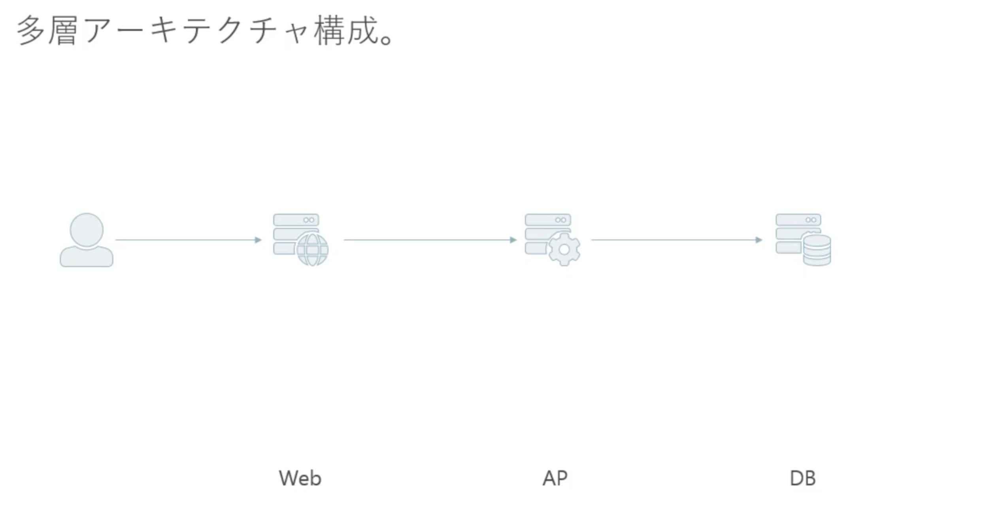
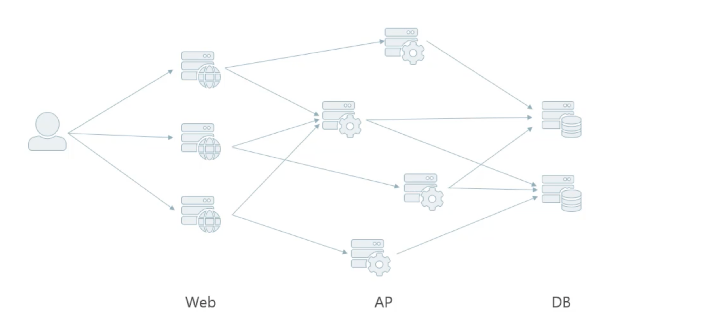

# REST と Web API について

## REST とは

REST とは、Representation State Transfer の略。具体的には分散型システムにおける設計原則群の事を指す。

俗に言う、RESTful API は、上記の REST の設計原則郡を満す Web API。  
URL を使用してリソースを解釈し、クラウドコンピューティングのアプリケーションやサービスを利用するビジネスのための優れた統合ソリューションを作る。

## REST のメリット

- ステートレスになるため、サーバー側のシステムは複雑にならない
- リソース指向の URI なので開発者は直感的に扱える
- 統一インターフェースなので互換性がある
- 外部向けとした API の場合に扱ってもらいやすい

## REST であるための設計原則

## 1. クライアント/サーバーモデル

クライアント側がリクエストを投げてサーバーがリクエストを受け取りレスポンスを返す。

画面（UI）とデータで関心事が分離されており、クライアントがトリガーとなってサーバーからデータを取得し、画面にデータを表示するという一般的な Web の構成。

## 2. 階層化システム

階層化システムであることも REST の設計原則の 1 つに含まれる。

システムのアーキテクチャの代表的な例として挙げられるのが多層アーキテクチャ。



ここで述べられている階層化システムとは・・



## 3. 統一インターフェース

統一インターフェースを作る上で制約が 3 つ存在する。

### 1. リソースの識別が行われているかどうか。

ここで述べるリソースとはサーバーに保存されてあるあらゆるデータの事を指す。  
 例えば、ドキュメント、画像、サービス、状態 etc...  
 またここでは、断面的なデータも含む。（2021 年 4 月 1 日現在のデータや、最新のデータのこと）

### 2. 表現を用いたリソース操作が行われているかどうか。

ここで述べる表現とはある断面におけるデータのこと。具体的には、Request, Response, Post されたデータのことを指す。
また認証情報としてのメタデータもここでは含まれる。

### 3. 記述メッセージが含まれているかどうか

ここでの記述メッセージとは、リクエストヘッダーやレスポンスヘッダーを指す。具体的には、リクエストボディやレスポンスボディにはどのような情報が含まれているかをヘッダーに明記する必要がある。（例: content-type）

## 4. キャッシュ制御

REST アーキテクチャースタイル内では、通過する情報は、キャッシュ可能またはキャッシュ不可能としてラベル付けする必要がある。応答がキャッシュ可能である場合、クライアントは、同様の要求を満たすために後でデータを再利用することができる。（[Cache-Control](https://developer.mozilla.org/ja/docs/Web/HTTP/Headers/Cache-Control)）

## 5. ステートレス

http, https 通信を使用して、ステートレスなデータのやり取りが行われているかどうか。  
 ステートレスとは？？（例: ハンバーガーショップ）

ステートフルな場合  
 客「ハンバーガーセットをください」  
 店員「サイドメニューは何にしますか？？」  
 客「ポテトでお願いします。」  
 店員「ドリンクは何にしますか？」  
 客「コーラでお願いします。」  
 店員「ハンバーガーセットでサイドメニューがポテトでドリンクがコーラですね。かしこまりました」

このように客の注文（リクエスト）をするたびにサーバー側でリクエスト内容を保持しながら、リクエストを受ける
　形だと注文内容をサーバーで一時的に保持する必要性がある。これは処理が複雑化してしまい、またスケールアウト
行いづらい。

ステートレスの場合  
 客「ハンバーガーセットをください。」  
 店員「サイドメニューは何にしますか？」  
 客「ハンバーガーセットでサイドメニューはポテトでお願いします。」  
 店員「ドリンクは何にしますか？」  
 客「ハンバーガーセットでサイドメニューがポテト、ドリンクはコーラでお願いします。」  
 店員「ハンバーガーセットでサイドメニューがポテトでドリンクがコーラですね。かしこまりました」

この状態だと、注文内容は一度のリクエストで常に分かる状態となりバックエンド側で複雑化せず、またどのようなサーバーでも認識できる情報であるため、ステートレスであることには意味がある。

## URI の設計ルール

### 1. 短く入力しやすいものにする。

リソースの操作に関連するワードのみしかいれない。URI 内のワードの重複は避ける。

### 2. 人が読んで理解できる。

### 3 大文字、小文字の混在をしない。

基本的に小文字を使用する。

### 4 単語はハイフンでつなぐ。

単語の連続でハイフンを使用するケースはそもそも URI の見直しを行う。

### 5 複数形で使用する。

基本的にリソースは複数形なので、複数形を使用する。リソース内の特定のデータを扱う際には、そのデータを一意に表現するもの、（例えば ID）を使用する。

### 6 エンコードする必要がある文字を使用しない

例えば日本語。日本語を URI とすると、エンコードが必要となり、エンコード後の URL は人間に理解する事は出来ないので避ける。

### 7 サーバー側のアーキテクチャを反映しない

悪意あるユーザーに脆弱性を突かれる可能性がある。

```
Bad case -> GET https://api.example.com/cgi-bin/get-user.png?id=12345
```

```
Good case -> GET https://api.example.com/users/12345
```

### 8 改造しやすい

システム依存の設計にしない

```
Bad case -> https://api.example.com/staging/items/12345
```

```
Bad case -> https://api.example.com/test/items/12345
```

```
Good case -> https://api.example.com/items/12345
```

### 9 ルールが統一化されている

例えば、GET がクエリパラメーターなのに POST がパスパラメーターといった操作。
POST がパスパラメーターであれば、GET はパスパラメーターにする。

## データフォーマットの指定方式

データフォーマットには 3 種類のデータフォーマットが存在する。

- XML content-type: application/xml
- JSON content-type: application/json
- JSONP content-type: application/javascript

基本的に Web API では、JSON を返すようにする。  
またデータフォーマットの指定方式は 3 つ存在する。

1. クエリパラメーター

```
https://api.example.com/items?format=json
```

2. 拡張子

```
https://api.example.com/items.json
```

3. リクエストヘッダー

```
https://api.example.com/items

http header
content-type: applicaition/json
```

WebAPI では基本的にリクエストヘッダーでフォーマットを指定するようにする。

## データの内部構造

1. データの内部構造にエンベローブを使用しない。→ レスポンスヘッダーと内容が重複するため。
   _エンベローブとはレスポンスボディのメタ情報のことを指す。_

2. オブジェクトはなるべくフラットにする。

```js
// ↓だめなケース
{
 "id": "12345",
 "name": "Fujisawa ryohei",
 "profile": {
   "birthday": "3/23",
   "gender": "male"
 }
}
// ↓良いケース
{
 "id": "12345",
 "name": "Fujisawa ryohei",
 "birthday": "3/23",
 "gender": "male"
}
```

3. プロパティの命名規則は API 全体で統一する。  
   プロパティの表記方法には 3 種類存在する。

- スネークケース
- キャメルケース
- パスカルケース
  基本的に、JSON はキャメルケースを使用する。

4. 日付には RFC3339（W3C-DTF）形式を使用する。  
   インターネットで標準で使用されているため。

5. 大きな整数（64bit 整数）は文字列で返す。  
   JavaScript では`2^53 - 1`までしか整数が扱えないため、これより大きな整数になりうる可能性も考えて、大きな整数は文字列で返すほうが良い。

## エラー表現

- エラーメッセージを含めよう。  
  エラーかどうかはリクエストヘッダーのステータスコードでわかる。
  しかし、何がエラーなのかはわからん。→ エラー詳細メッセージをレスポンスボディに含めよう。
- HTML を返さないようにしよう。  
  クライアントが受け付けているのは、HTML ではなく JSON なため JSON を返すようにする。
- サービス閉塞時には、ステータスコード 503 で、リクエストヘッダーに Retry After を加えよう。
