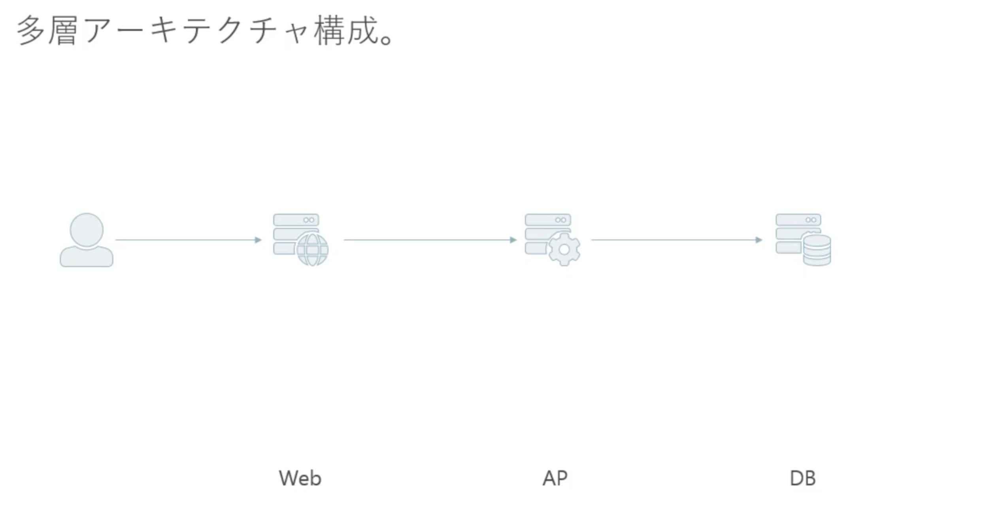
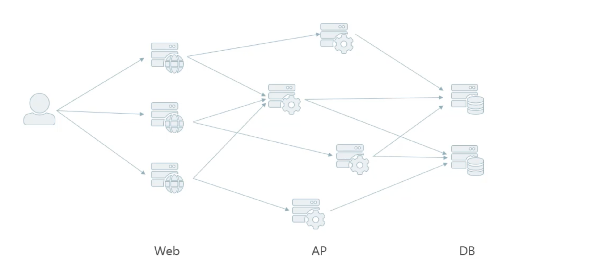

## REST

REST とは、Representation State Transfer の略。具体的には分散型システムにおける設計原則群の事を指す。

俗に言う、RESTful API は、上記の REST の設計原則郡を満す Web API。\
URL を使用してリソースを解釈し、クラウドコンピューティングのアプリケーションやサービスを利用するビジネスのための優れた統合ソリューションを作る。

## REST のメリット

- ステートレスになるため、サーバー側のシステムは複雑にならない
- リソース指向の URI なので開発者は直感的に扱える
- 統一インタフェースなので互換性がある
- 外部向けとした API の場合に扱ってもらいやすい

## REST であるための設計原則

## 1. クライアント／サーバーモデル

クライアント側がリクエストを投げてサーバーがリクエストを受け取りレスポンスを返す。

画面（UI）とデータで関心事が分離されており、クライアントがトリガーとなってサーバーからデータを取得し、画面にデータを表示するという一般的な Web の構成。

## 2. 階層化システム

階層化システムであることも REST の設計原則の 1 つに含まれる。

システムのアーキテクチャの代表的な例として挙げられるのが多層アーキテクチャ。



ここで述べられている階層化システムとは。



## 3. 統一インタフェース

統一インタフェースを作る上で制約が 3 つ存在する。

### 1. リソースの識別が行われているかどうか。

ここで述べるリソースとはサーバーに保存されてあるあらゆるデータの事を指す。\
 例えば、ドキュメント、画像、サービス、状態 etc...\
 またここでは、断面的なデータも含む（2021 年 4 月 1 日現在のデータや, 最新のデータのこと）

### 2. 表現を用いたリソース操作が行われているかどうか。

ここで述べる表現とはある断面におけるデータのこと。具体的には、Request, Response, Post されたデータのことを指す。
また認証情報としてのメタデータもここでは含まれる。

### 3. 記述メッセージが含まれているかどうか

ここでの記述メッセージとは、リクエストヘッダーやレスポンスヘッダーを指す。具体的には、リクエストボディやレスポンスボディにはどのような情報が含まれているかをヘッダーに明記する必要がある（例: content-type）

## 4. キャッシュ制御

REST アーキテクチャースタイル内では、通過する情報は、キャッシュ可能またはキャッシュ不可能としてラベル付けする必要がある。応答がキャッシュ可能である場合、クライアントは、同様の要求を満たすために後でデータを再利用できる（[Cache-Control](https://developer.mozilla.org/ja/docs/Web/HTTP/Headers/Cache-Control)）

## 5. ステートレス

http, https 通信を使用して、ステートレスなデータのやり取りが行われているか。\
ステートレスとは（例: ハンバーガーショップ）

### ステートフルな場合

> 客「ハンバーガーセットをください」\
> 店員「サイドメニューは何にしますか？」\
> 客「ポテトでお願いします」\
> 店員「ドリンクは何にしますか？」\
> 客「コーラでお願いします」\
> 店員「ハンバーガーセットでサイドメニューがポテト、ドリンクがコーラですね。かしこまりました」

このように客の注文（リクエスト）をするたびにサーバー側でリクエスト内容を保持しながら、リクエストを受ける
　形だと注文内容をサーバーで一時的に保持する必要性がある。これは処理が複雑化してしまい、またステートが 1 台のサーバーに依存してしまうため、スケールアウトが
行いづらい。

### ステートレスの場合

> 客「ハンバーガーセットをください」\
> 店員「サイドメニューは何にしますか」\
> 客「ハンバーガーセットでサイドメニューはポテトでお願いします」\
> 店員「ドリンクは何にしますか」\
> 客「ハンバーガーセットでサイドメニューがポテト、ドリンクはコーラでお願いします」\
> 店員「ハンバーガーセットでサイドメニューがポテト、ドリンクがコーラですね。かしこまりました」

この状態だと、注文内容は一度のリクエストで常に分かる状態となりバックエンド側で複雑化せず、\
またどのようなサーバーでも認識できる情報であるため、ステートレスであることには意味がある。

## URI の設計ルール

### 1. 短く入力しやすいものにする。

リソースの操作に関連する Word のみしかいれない。URI 内の Word の重複は避ける。

### 2. 人が読んで理解できる。

### 3 大文字、小文字の混在をしない。

基本的に小文字を使用する。

### 4 単語はハイフンでつなぐ。

単語の連続でハイフンを使用するケースはそもそも URI の見直しを行う。

### 5 複数形で使用する。

基本的にリソースは複数形なので、複数形を使用する。リソース内の特定のデータを扱う際には、そのデータを一意に表現するもの、（例えば ID）を使用する。

### 6 エンコードする必要がある文字を使用しない

例えば日本語。日本語を URI とすると、エンコードが必要となり、エンコード後の URL は人間に理解する事は出来ないので避ける。

### 7 サーバー側のアーキテクチャを反映しない

悪意あるユーザーに脆弱性を突かれる可能性がある。

```sh
# Bad Case
GET https://api.example.com/cgi-bin/get-user.png?id=12345
```

```sh
 # Good Case
 GET https://api.example.com/users/12345
```

### 8 改造しやすい

システム依存の設計にしない。

```sh
# Bad Case
https://api.example.com/staging/items/12345
```

```sh
# Bad Case
https://api.example.com/test/items/12345
```

```sh
# Good Case
https://api.example.com/items/12345
```

### 9 ルールが統一化されている

例えば、ある URL において、GET がクエリパラメーターなのに POST がパスパラメーターといった操作。
POST がパスパラメーターであれば、GET はパスパラメーターにする。

# Web API を設計すべき時に気にするところ

## データフォーマットの指定方式

データフォーマットには 3 種類のデータフォーマットが存在する。

- XML content-type: application/xml
- JSON content-type: application/json
- JSONP content-type: application/JavaScript

基本的に Web API では、JSON を返すようにする。\
またデータフォーマットの指定方式は 3 つ存在する。

1. クエリパラメーター

```sh
https://api.example.com/items?format=json
```

2. 拡張子

```sh
https://api.example.com/items.json
```

3. リクエストヘッダー

```sh
https://api.example.com/items

# http header
content-type: applicaition/json
```

Web API では基本的にリクエストヘッダーでフォーマットを指定するようにする。

## データの内部構造

1. データの内部構造にエンベローブを使用しない。→ レスポンスヘッダーと内容が重複するため。\
   _エンベローブとはレスポンスボディのメタ情報のことを指す。_
2. オブジェクトはなるべくフラットにする。

```js
// Bad Case
{
 "id": "12345",
 "name": "Fujisawa ryohei",
 "profile": {
   "birthday": "3/23",
   "gender": "male"
 }
}
// Good Case
{
 "id": "12345",
 "name": "Fujisawa ryohei",
 "birthday": "3/23",
 "gender": "male"
}
```

3. プロパティの命名規則は API 全体で統一する。\
   プロパティの表記方法には 3 種類存在する。

- スネークケース
- キャメルケース
- パスカルケース
  基本的に、JSON はキャメルケースを使用する。

4. 日付には RFC 3339（W3C-DTF）形式を使用する。\
   インターネットで標準使用されているため。
5. 大きな整数（64bit 整数）は文字列で返す。\
   JavaScript では`2^53 - 1`までしか整数が扱えないため、これより大きな整数になりうる可能性も考えて、大きな整数は文字列で返すほうが良い。

## エラー表現

- エラーメッセージを含める。\
  エラーかどうかはリクエストヘッダーのステータスコードでわかる。  
  しかし、何がエラーなのかはわからない。なので、エラー詳細メッセージをレスポンスボディに含める。
- HTML を返さないようにしよう。\
  クライアントが受け付けているのは、HTML ではなく JSON なため JSON を返すようにする。
- サービス閉塞時には、ステータスコード 503 で、リクエストヘッダーに Retry After を加えよう。

## API バージョンの表現

API バージョンを表現する方法は 3 種類存在する。

1. パス

```sh
http://api.example.com/v1/users
```

2. クエリ

```sh
http://api.example.com/users?version=1
```

3. ヘッダー

```sh
http://api.example.com/users
X-Api-Version: 1

# Xを接頭辞においたバージョン管理は非推奨となったため、アプリケーションの固有名詞を接頭辞に置く。
例: GData-Version
```

REST API 設計上、パスにバージョンを含めるよりは、ヘッダーに含めたほうが良い。

### セマンティックバージョニングについて

セマンティックバージョニングとは、バージョン番号に意味づけを行うという考え方。
Semantic Versioning は、主として、ライブラリ向けのバージョン番号に使われる事が多いらしくそこまで考える必要はなさそう。

- バージョン 1 : メジャー（後方互換しない修正）
- バージョン 2 : マイナー（後方互換のある修正）
- バージョン 3 : パッチ（バグ修正）

## 大量アクセス対策

### レートリミットとは。

時間辺りでアクセス制限をかける事。

### Web アプリを API 化することで発生する問題点

API 化により、簡単に大量アクセスするプログラムが書ける意図しないプログラマの不注意で大量アクセスが発生する。
上記の解決策として必要なのがレートリミット。

### [レートリミットアルゴリズム](https://christina04.hatenablog.com/entry/rate-limiting-algorithm)

1. fixed window
2. sliding log
3. sliding widnow

逆に、サービス利用者が多く自社にとって優良顧客である場合などのケースが存在する場合のアクセス元の制限緩和についても Web API 設計においては考える必要がある。

## キャッシュ制御 対策

- Expires
- Cache-control + Date\
   キャッシュの「可否」「期限」を指定。「可否」= public, private, no-cache, no-store
- Last-Modified + ETag\
  Last-Modified にリソース最終更新日時を指定
  ETag に特定バージョンを示す文字列を指定。\
  → コンテンツのハッシュ、バージョン番号、最終更新日時のハッシュ

## セキュリティ対策

こちらざっとまとめたものなので完全に網羅しているものとは言えません。  
基本的な Web Security 脆弱性に対する対策を記載しておりますが、この辺についてはまだまだ調べる余地がありそうです。

### XSS

内容: 悪意のあるユーザーが正規のサイトに不正なスクリプトを埋め込み、そのサイトのユーザー情報等を抜き出す攻撃手法。

対策について。

1.  レスポンスヘッダーで X-XSS-Protection を"1"に指定して XSS フィルタリングを有効化。
2.  レスポンスヘッダーで X-Frame-Options を"DENY"に指定して iframe タグ呼び出しを拒否。
3.  レスポンスヘッダーで X-Content-Type-Options を"noshift"で指定して IE 脆弱性対応。

### X-XSS-Protection 詳細

> Chrome は XSS Auditor を削除しました
> Firefox は対応しておらず、 X-XSS-Protection を今後も実装しません
> Edge は XSS filter を廃止しました
> つまり、レガシーブラウザをサポートする必要がない場合は、代わりに Content-Security-Policy を使用し unsafe-inline を許可しないことをお勧めします。

とのことなので、古いブラウザに対応する必要がある場合にのみ、X-XSS-Protection を指定する。  
参考: https://developer.mozilla.org/ja/docs/Web/HTTP/Headers/X-XSS-Protection

そうではない場合、X-XSS-Protection の代わりに、Content-Security-Policy を設定する。  
参考: https://developer.mozilla.org/ja/docs/Web/HTTP/CSP

### X-Frame-Options 詳細

- X-Frame-Options を指定すると何が嬉しいのか  
  https://nulab.com/ja/blog/typetalk/measure-clickjacking/

- X-Frame-Options に関しては、あくまで外部サイトから iframe でページを埋め込まれた際のクリックジャッキング攻撃に対する対策として行うもの。
  なので、HTML を返却するサーバーを作成することが前提。すなわち Web API では指定する必要はなさそう。

### X-Content-Type-Options 詳細

参考: https://developer.mozilla.org/ja/docs/Web/HTTP/Headers/X-Content-Type-Options

### CSRF

内容:　本来拒否する必要があるアクセス元からのリクエストを処理してしまう問題。

対策について。

1. 許可しないアクセス元からのリクエストを拒否。

- システム単位で実行可否判断をする場合: クライアントにリクエストヘッダーで X-API-KEY を指定させる。
- ユーザー単位で実行可否判断をする場合: クライアントにリクエストヘッダーで Authentication を指定させる。

2. 攻撃者に推測されにくいトークンの発行/照合処理を実装。

- クライアントにリクエストヘッダーで X-CSRF-TOKEN を指定させる。サーバー側で X-CSRF-TOKEN を取り出して、照合処理をする。

### HTTP

内容
通信経路が暗号化されないので盗聴されやすい。

対策について。

- 常時 HTTPS を利用した通信をする。
  - SSL: 安全に通信するためのプロトコル。2015 年に使用禁止。
  - TLS: 安全に通信するためのプロトコル。SSL の後継。
  - HTTPS: HTTPS + SSL/TLS。Web で安全に通信を通信するプロトコル。

### JWT

内容: クライアント側で編集/参照が簡単にできるため、サーバー側の検証が不十分だと改ざんされた情報を正規に受け入れてしまう。

対策について。

- ヘッダーの alg に"none"以外を指定して署名を暗号化する。
